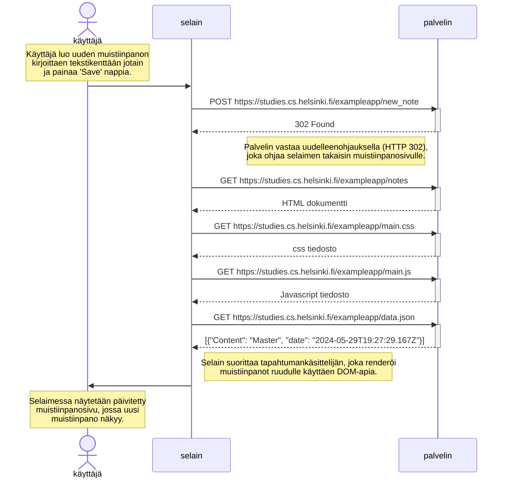

# uusi muistiinpano

```mermaid

sequenceDiagram
    actor käyttäjä
    participant selain
    participant palvelin

    Note over käyttäjä: Käyttäjä luo uuden muistiinpanon<br/> kirjoittaen tekstikenttään jotain<br/> ja painaa 'Save' nappia.

    käyttäjä->>selain: 

    selain->>palvelin: POST https://studies.cs.helsinki.fi/exampleapp/new_note
    activate palvelin
    palvelin-->>selain: 302 Found
    deactivate palvelin

    Note left of palvelin: Palvelin vastaa uudelleenohjauksella (HTTP 302),<br/> joka ohjaa selaimen takaisin muistiinpanosivulle.

    selain->>palvelin: GET https://studies.cs.helsinki.fi/exampleapp/notes
    activate palvelin
    palvelin-->>selain: HTML dokumentti
    deactivate palvelin

    selain->>palvelin: GET https://studies.cs.helsinki.fi/exampleapp/main.css
    activate palvelin
    palvelin-->>selain: css tiedosto
    deactivate palvelin

    selain->>palvelin: GET https://studies.cs.helsinki.fi/exampleapp/main.js
    activate palvelin
    palvelin-->>selain: Javascript tiedosto
    deactivate palvelin

    selain->>palvelin: GET https://studies.cs.helsinki.fi/exampleapp/data.json
    activate palvelin
    palvelin-->>selain: [{"Content": "Master", "date": "2024-05-29T19:27:29.167Z"}]
    deactivate palvelin

    Note right of selain: Selain suorittaa tapahtumankäsittelijän, joka renderöi<br/> muistiinpanot ruudulle käyttäen DOM-apia.

    selain->>käyttäjä: 

    Note over käyttäjä: Selaimessa näytetään päivitetty<br/> muistiinpanosivu, jossa uusi<br/> muistiinpano näkyy.
```
