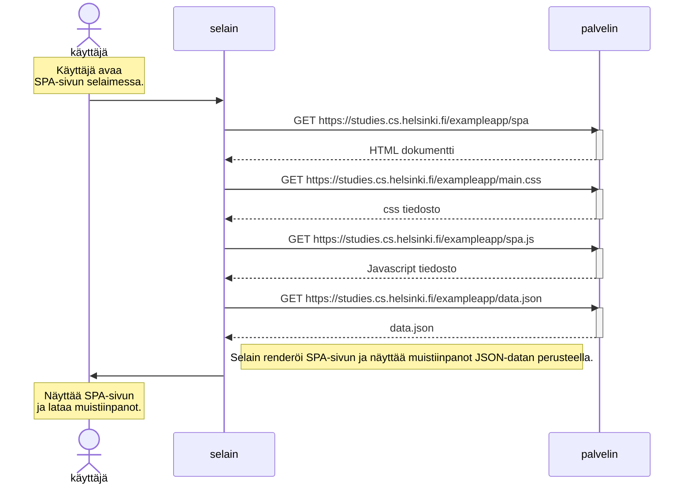

# Single Page App

```mermaid

sequenceDiagram
    actor käyttäjä
    participant selain
    participant palvelin

    Note over käyttäjä: Käyttäjä avaa<br/> SPA-sivun selaimessa.

    käyttäjä->>selain: 

    selain->>palvelin: GET https://studies.cs.helsinki.fi/exampleapp/spa
    activate palvelin
    palvelin-->>selain: HTML dokumentti
    deactivate palvelin

    selain->>palvelin: GET https://studies.cs.helsinki.fi/exampleapp/main.css
    activate palvelin
    palvelin-->>selain: css tiedosto
    deactivate palvelin

    selain->>palvelin: GET https://studies.cs.helsinki.fi/exampleapp/spa.js
    activate palvelin
    palvelin-->>selain: Javascript tiedosto
    deactivate palvelin

    selain->>palvelin: GET https://studies.cs.helsinki.fi/exampleapp/data.json
    activate palvelin
    palvelin-->>selain: data.json
    deactivate palvelin

    Note right of selain: Selain renderöi SPA-sivun ja näyttää muistiinpanot JSON-datan perusteella.

    selain->>käyttäjä: 

    Note over käyttäjä: Näyttää SPA-sivun<br/> ja lataa muistiinpanot.
```
