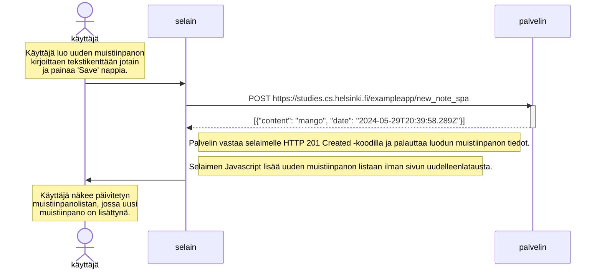

# Uusi muistiinpano

```mermaid

sequenceDiagram
    actor käyttäjä
    participant selain
    participant palvelin

    Note over käyttäjä: Käyttäjä luo uuden muistiinpanon<br/> kirjoittaen tekstikenttään jotain<br/> ja painaa 'Save' nappia.

    käyttäjä->>selain: 

    selain->>palvelin: POST https://studies.cs.helsinki.fi/exampleapp/new_note_spa
    activate palvelin
    palvelin-->>selain: [{"content": "mango", "date": "2024-05-29T20:39:58.289Z"}]
    deactivate palvelin

    Note left of palvelin: Palvelin vastaa selaimelle HTTP 201 Created -koodilla ja palauttaa luodun muistiinpanon tiedot.

    Note right of selain: Selaimen Javascript lisää uuden muistiinpanon listaan ilman sivun uudelleenlatausta.

    selain->>käyttäjä: 

    Note over käyttäjä: Käyttäjä näkee päivitetyn<br/> muistiinpanolistan, jossa uusi<br/> muistiinpano on lisättynä.
```
